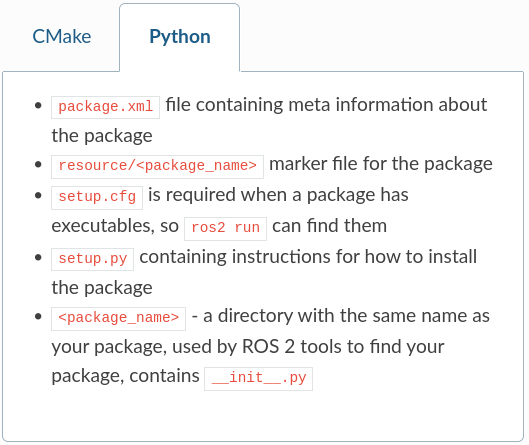

# Using colcon to build packages
colcon is an iteration on the ROS build tools catkin_make, catkin_make_isolated, catkin_tools and ament_tools.<br>

We must first install it:
```bash
$ sudo apt install python3-colcon-common-extensions
```
## Basics
A ROS workspace is a directory with a particular structure.<br> Commonly there is a src subdirectory.<br>
Inside that subdirectory is where the source code of ROS packages will be located. Typically the directory starts otherwise empty.<br>
colcon performs out-of-source builds.<br>
By default it will create the following directories as peers of the src directory:
- The build directory will be where intermediate files are stored.<br> 
For each package a subfolder will be created in which e.g. CMake is being invoked.
- The install directory is where each package will be installed to.<br>
By default each package will be installed into a separate subdirectory.
- The log directory contains various logging information about each colcon invocation.
### Create a workspace
```bash
$ mkdir -p ~/ros2_ws/src
$ cd ~/ros2_ws

#Then, clone the examples into the src directory of the workspace
```
It is important that we have sourced the environment for an existing ROS 2 installation that will provide our workspace with the necessary build dependencies for the example packages.<br>  
This is achieved by sourcing the setup script provided by a binary installation or a source installation, i.e. another colcon workspace (see Installation).<br>
We call this environment an underlay.
Our workspace, ros2_ws, will be an overlay on top of the existing ROS 2 installation.<br> 
In general, it is recommended to use an overlay when you plan to iterate on a small number of packages, rather than putting all of your packages into the same workspace.
### Build the workspace
In the root of the workspace, run colcon build.
```bash
# Source source /opt/ros/humble/setup.bash, then:
$ colcon build --executor sequential --symlink-install
# Check what this does on the documentation if needed
# After the build is finished, we should see the build, install, and log directories
```
### Run tests
```bash
#To run tests for the packages we just built:
$ colcon test
```
### Source the environment
When colcon has completed building successfully, the output will be in the install directory.<br> 
Before you can use any of the installed executables or libraries, you will need to add them to your path and library paths.<br>  
colcon will have generated bash/bat files in the install directory to help set up the environment.<br> 
These files will add all of the required elements to your path and library paths as well as provide any bash or shell commands exported by packages.
```bash
#To run tests for the packages we just built:
$ source install/setup.bash
```
## Create your own package
Check the documentation for a Python/C++ example.<br>
colcon uses the package.xml specification.<br>
colcon supports multiple build types.<br> 
The recommended build types are ament_cmake and ament_python. Also supported are pure cmake packages.<br>
For convenience, you can use the tool ros2 pkg create to create a new package based on a template. More on that in a later chapter.
## Setup colcon_cd
The command colcon_cd allows you to quickly change the current working directory of your shell to the directory of a package.<br>
As an example colcon_cd some_ros_package would quickly bring you to the directory ~/ros2_ws/src/some_ros_package.<br>
To set up colcon_cd you need to run the following commands to modify your shell startup script:
```bash
#To run tests for the packages we just built:
$ echo "source /usr/share/colcon_cd/function/colcon_cd.sh" >> ~/.bashrc
$ echo "export _colcon_cd_root=/opt/ros/humble/" >> ~/.bashrc
'''
Depending on the way you installed colcon_cd and where your workspace is, the instructions above may vary, please refer to the documentation for more details. To undo this in Linux and macOS, locate your system’s shell startup script and remove the appended source and export commands.
'''
```
## Setup colcon tab completion
https://colcon.readthedocs.io/en/released/user/installation.html#enable-completion
## Tips
1. If you do not want to build a specific package, then place an empty file named COLCON_IGNORE in the directory and it will not be indexed.
2. If you want to avoid configuring and building tests in CMake packages you can pass: --cmake-args -DBUILD_TESTING=0.
3. If you want to run a single particular test from a package:
```bash
$ colcon test --packages-select YOUR_PKG_NAME --ctest-args -R YOUR_TEST_IN_PKG
```
## Setup colcon mixins
Various command line options are tedious to write and/or difficult to remember.<br>
To make common command line options easier to invoke this repository makes these “shortcuts” available.<br>
To install the default colcon mixins, run the following:
```bash
$ colcon mixin add default https://raw.githubusercontent.com/colcon/colcon-mixin-repository/master/index.yaml
$ colcon mixin update default

# Then, try out using the debug mixin:
# $colcon build --mixin debug
```

---
# Creating a workspace
A workspace is a directory containing ROS 2 packages.<br>
Before using ROS 2, it’s necessary to source your ROS 2 installation workspace in the terminal you plan to work in.<br>
This makes ROS 2’s packages available for you to use in that terminal.<br>
You also have the option of sourcing an “overlay” - a secondary workspace where you can add new packages without interfering with the existing ROS 2 workspace that you’re extending, or “underlay”.<br>
Your underlay must contain the dependencies of all the packages in your overlay.<br>
Packages in your overlay will override packages in the underlay.<br>
It’s also possible to have several layers of underlays and overlays, with each successive overlay using the packages of its parent underlays.
## Tasks
### 1. Source ROS 2 environment
```bash
# Your main ROS 2 installation will be your underlay for this tutorial. (Keep in mind that an underlay does not necessarily have to be the main ROS 2 installation.)
$ source /opt/ros/humble/setup.bash
```
### 2. Create a new directory
```bash
# Best practice is to create a new directory for every new workspace. 
$ mkdir -p ~/ros2_ws/src
$ cd ~/ros2_ws/src

# Another best practice is to put any packages in your workspace into the src directory.
```
### 3. Clone a sample repo
Ensure you're still in the ros2_ws/src directory.<br>
You will usually create your own packages, but for now it's better to practice putting a workspace together using existing packages.<br>
A repo can have multiple branches. You need to check out the one that targets your installed ROS 2 distro.<br>
```bash
# In the ros2_ws/src directory: 
$ git clone https://github.com/ros/ros_tutorials.git -b humble

# Now ros_tutorials, which contains turtlesim, is now cloned in your workspace
# !!! The other packages in this repository are not built because they contain a COLCON_IGNORE file.
```
So far you have populated your workspace with a sample package, but it isn’t a fully-functional workspace yet.<br>
You need to resolve the dependencies first and then build the workspace.
### 4. Resolve dependencies
Before building the workspace, you need to resolve the package dependencies.<br>
Best practice is to check for dependencies every time you clone.<br>
```bash
# If you're still in the src directory with the ros_tutorials clone:
$ cd ..
# From the root of your workspace (ros2_ws), run the following command:
$ rosdep install -i --from-path src --rosdistro humble -y

# If you have all your dependencies, you'll get a success message!
```
### 5. Build the workspace with colon
From ros2_ws (root of workspace), you can now build your packages:
```bash
$ $ colcon build --executor sequential --symlink-install 
# ls, you'll now see new directories
# The install directory is where your workspace’s setup files are, which you can use to source your overlay.

# Check the documentation for other useful arguments for colcon build!
```
### 6. Source the overlay
Before sourcing the overlay, it is very important that you open a new terminal, separate from the one where you built the workspace. 
In the new terminal, source your main ROS 2 environment as the “underlay”, so you can build the overlay “on top of” it:
```bash
$ source /opt/ros/humble/setup.bash

$ cd ~/ros2_ws

$ source install/local_setup.bash

'''
Sourcing the local_setup of the overlay will only add the packages available in the overlay to your environment. setup sources the overlay as well as the underlay it was created in, allowing you to utilize both workspaces.
So, sourcing your main ROS 2 installation’s setup and then the ros2_ws overlay’s local_setup, like you just did, is the same as just sourcing ros2_ws’s setup, because that includes the environment of its underlay.
'''

# Now you can run the turtlesim package from the overlay:
$ ros2 run turtlesim turtlesim_node
```
### 7. Modify the overlay (optional)
But how can you tell that this is the overlay turtlesim running, and not your main installation’s turtlesim?<br>
Let’s modify turtlesim in the overlay so you can see the effects:
- You can modify and rebuild packages in the overlay separately from the underlay.
- The overlay takes precedence over the underlay.
You can modify turtlesim in your overlay by editing the title bar on the turtlesim window.<br>
To do this, locate the turtle_frame.cpp file in ~/ros2_ws/src/ros_tutorials/turtlesim/src. Open turtle_frame.cpp with your preferred text editor.<br>
Find the function setWindowTitle("TurtleSim");, change the value "TurtleSim" to "MyTurtleSim", and save the file.<br>
Return to the first terminal where you ran colcon build earlier and run it again.<br>
Return to the second terminal (where the overlay is sourced) and run turtlesim again:
```bash
$ ros2 run turtlesim turtlesim_node # you will now see that the title bar has changed
```
Even though your main ROS 2 environment was sourced in this terminal earlier, the overlay of your ros2_ws environment takes precedence over the contents of the underlay.<br>
To see that your underlay is still intact, open a brand new terminal and source only your ROS 2 installation. Run turtlesim again.

---
# Creating a package
A package is an organizational unit for your ROS 2 code.<br> 
If you want to be able to install your code or share it with others, then you’ll need it organized in a package.<br> 
Package creation in ROS 2 uses ament as its build system and colcon as its build tool.<br> 
You can create a package using either CMake or Python, which are officially supported, though other build types do exist.
### What makes up a ROS 2 package?
ROS 2 Python and CMake packages each have their own minimum required contents:

 <br>
A single workspace can contain as many packages as you want, each in their own folder.<br>
You can also have packages of different build types in one workspace (CMake, Python, etc.).<br> 
You cannot have nested packages.<br>
Best practice is to have a src folder within your workspace, and to create your packages in there. This keeps the top level of the workspace “clean”.<br>

```bash
'''
workspace_folder/
    src/
      cpp_package_1/
          CMakeLists.txt
          include/cpp_package_1/
          package.xml
          src/

      py_package_1/
          ...
      
      ...
'''
```
## Tasks
### 1. Create a package
Let's use the workspace already created, ros2_ws.<br>
```bash
$ cd ~/ros2_ws/src

# Create a new package in ROS 2:
$ ros2 pkg create --build-type ament_cmake --license Apache-2.0 <package_name> # C++
$ ros2 pkg create --build-type ament_python --license Apache-2.0 <package_name> # Python

# For this tutorial, the optional argument --node-name is used
# It creates a simple hello world type executable in the package

$ ros2 pkg create --build-type ament_cmake --license Apache-2.0 --node-name my_node my_package # C++

$ ros2 pkg create --build-type ament_python --license Apache-2.0 --node-name my_node my_package # Python

# You will now have a new folder within your workspace's src directory
```
### 1. Build a package
Putting packages in a workspace allows you to build many packages at once by running colcon build in the workspace root.
```bash
$ cd ~/ros2_ws # root
$ colcon build # build

# When you have many packages (remember turtlesim?), colcon build can take a long time, unless:
$ colcon build --packages-select my_package # build
```
### 2. Source the setup file
To use your new package and executable, you have to source ROS 2 in the root (ros2_ws).<br>
### 3. Use the package
To run the executable you created using the --node-name argument during package creation:
```bash
$ ros2 run my_package my_node # will return something like: hello world ...

# To save an update:
$ colcon build --executor sequential --symlink-install
```
### 4. Examine package contents
Inside ros2_ws/src/my_package, you will see the files and folders that ros2 pkg create automatically generated.<br>
my_node.cpp, inside the src directory, is wher all your custom c++ nodes will go.
### 5. Customize package.xml
You find it in root/src/package. Change what has a TODO.

---
# Writing a simple publisher and subscriber (C++)
In this tutorial, the nodes will pass information in the form of string messages to each other over a topic.<br> 
The example used here is a simple “talker” and “listener” system; one node publishes data and the other subscribes to the topic so it can receive that data.